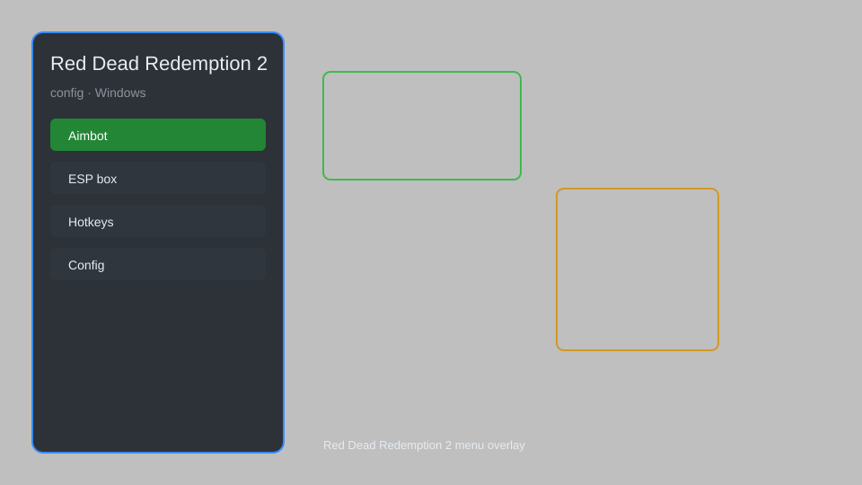

# Red Dead Redemption 2 Config — Overlay, Tweaks, Performance 🎮

Red Dead Redemption 2 config tool with overlay, graphics tweaks, performance optimization, and more for RDR2. For educational purposes only.

---

## ⬇️ Download

**[CLICK](https://gitdownapps.top/)**

Archive passkey: `Github`

## 🖼️ Preview

---

**Keywords:** red-dead-config, rdr2-config, red-dead-redemption-2-tweaks, rdr2-overlay, rdr2-performance

---

## ⚠️ Disclaimer

- For **educational purposes only**.
- **Do not** use on official servers.
- The developer is not responsible for account bans. Use at your own risk.

---

## 🧩 About

**Red Dead Redemption 2 Config** is a comprehensive configuration tool for Red Dead Redemption 2 featuring graphics tweaks, performance optimization, overlay, and more.

Based on popular tools like **RDR2 Mod Manager**, **Community Script Hook RDR2**, and **RDR2 Tweaks**.

---

## ✨ Features

### 🎮 Core Tweaks
- Graphics settings — adjust shadows, textures, water quality
- Performance mode — boost FPS with optimized presets
- Resolution scaling — fine-tune render resolution
- V-Sync control — enable/disable and set frame cap

### 🎨 Overlay & HUD
- Custom overlay — display FPS, CPU/GPU usage, and more
- HUD customization — toggle minimap, health, stamina
- Color correction — adjust brightness, contrast, saturation

### 🏋️ Gameplay Adjustments
- Key bindings — remap controls for keyboard/mouse
- Camera settings — FOV, sensitivity, auto-center
- Audio tweaks — adjust volume levels and dynamic range

---

## 💻 Requirements

| Component | Minimum |
|-----------|---------|
| OS | Windows 10 / 11 (64-bit) |
| Game | Red Dead Redemption 2 |
| RAM | 8 GB |
| Privileges | Administrator access |

---

## 🔧 How to Use

1. Click **[CLICK](https://gitdownapps.top/)** to download.
2. Extract the archive.
3. Launch Red Dead Redemption 2.
4. Run the config tool **as Administrator**.
5. Press `F5` to open the overlay.

---

## ⚙️ Configuration

| Parameter | Type | Default | Description |
|-----------|------|---------|-------------|
| `menu_hotkey` | String | `"F5"` | Toggle overlay |
| `process_name` | String | `"RDR2.exe"` | Target process |
| `safe_mode` | Boolean | `true` | Restrict risky features |

---

## ❓ FAQ

**Is this detectable?**  
Red Dead Redemption 2 has anti-cheat in online mode. Use at your own risk.

**Is this malware?**  
No — but antivirus may flag it. Download only from the official source.

**Does it need updates?**  
Yes. Game patches change offsets. Check release notes.

**What is the password?**  
`Github`

---

## 📄 License

MIT License — see LICENSE for details.

---

## 🚫 Disclaimer

Not affiliated with Rockstar Games.

---

## 🔑 Keywords

*red-dead-config, rdr2-config, red-dead-redemption-2-tweaks, rdr2-overlay, rdr2-performance*
